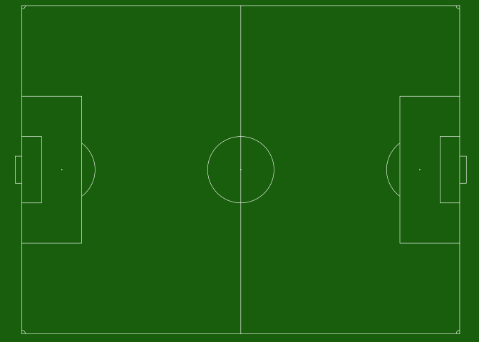

<!-- README.md is generated from README.Rmd. Please edit that file -->

# sportyR

<!-- badges: start -->
<!-- badges: end -->

As the field of sports analytics evolve, there’s a growing need for
methods to both track and visualize players throughout the game. This
package aims to make this easy regardless of sport needed to be plotted.

## Installation

You can install the released version of `sportyR` from [GitHub]() with:

``` r
# install.packages("devtools")
devtools::install_github("rossdrucker/sportyR")
```

## Functional Overview

All functions in this library follow the same general format. They’ll be
called `geom_{sport}`, and take the following arguments:

-   `league`: the league for the sport. In all functions, this will
    ***NOT*** have a default value. Failure to supply will prompt the
    user for a league.

-   `full_surf`: a boolean indicating whether or not to plot the full
    surface. This defaults to `TRUE`. **NOTE**: this argument is not
    necessary for soccer pitches, baseball diamonds, or football fields,
    as these surfaces are always shown in full.

-   `rotate`: a boolean indicating whether or not to rotate the surface.
    All surfaces will be horizontal by nature. This defaults to `FALSE`

-   `rotation_dir`: the direction in which to rotate the plot (if
    `rotate == TRUE`). This defaults to `'ccw'` for counterclockwise

## Examples

Most playing surfaces are standard in size, so they can be rendered via
a call to the proper `geom_{sport}` like so:

``` r
library(sportyR)
geom_hockey('nhl')
```


However, certain functions are able to take additional parameters. As an
example, soccer pitches are not always a standard size. For this reason,
users can specify in the call to `geom_soccer()` what the touchline and
goal line dimensions should be (in meters).

``` r
geom_soccer('fifa')
```



``` r
geom_soccer('fifa', touchline_length = 100, goal_line_length = 75)
```


