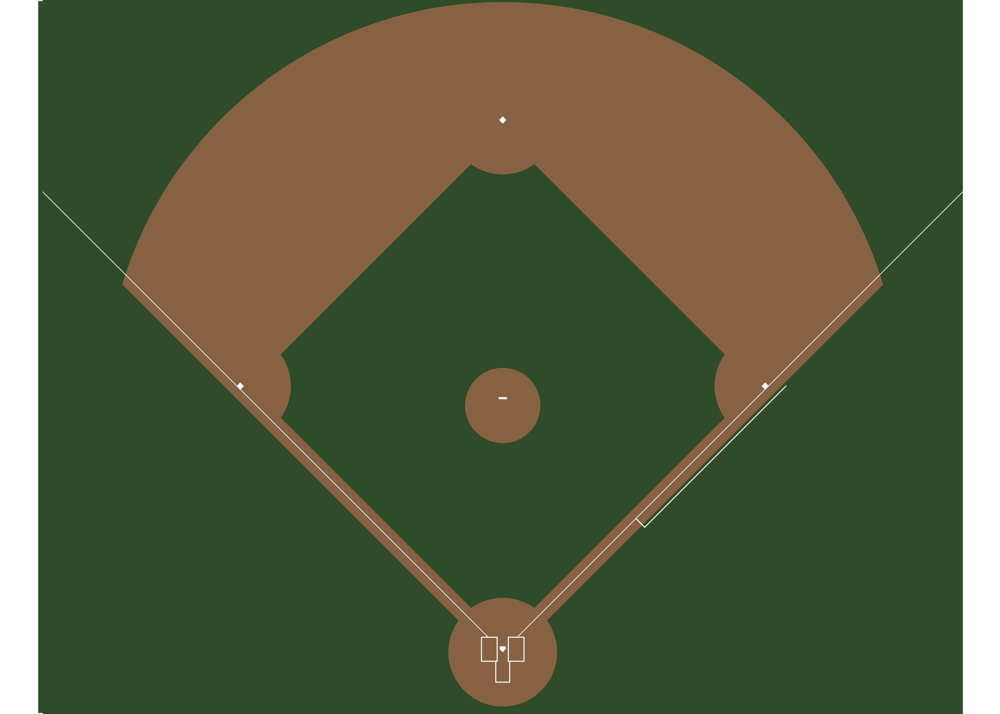
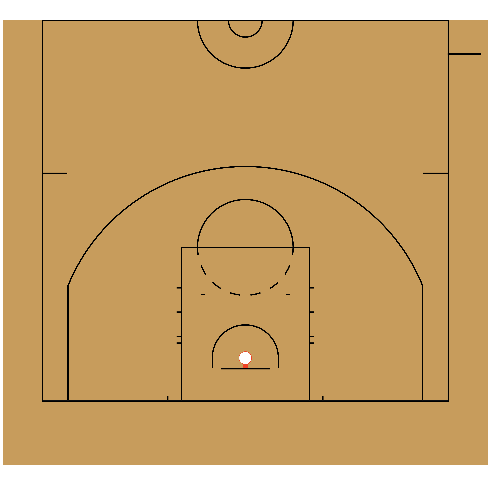

<!-- README.md is generated from README.Rmd. Please edit that file -->

# sportyR 

[](https://CRAN.R-project.org/package=sportyR)
[](https://CRAN.R-project.org/package=sportyR)
[](https://github.com/sportsdataverse/sportyR/)
[](https://github.com/sportsdataverse/sportyR/actions/workflows/R-CMD-check.yaml)
[](https://github.com/sportsdataverse/sportyR/)
[](https://twitter.com/sportyR)
[](https://twitter.com/sportsdataverse)

As the field of sports analytics evolve, there’s a growing need for
methods to both track and visualize players throughout the game. This
package aims to make this easy regardless of sport needed to be plotted.

## Installation

The most recent release of `sportyR` is available on
[CRAN](https://cran.r-project.org/web/packages/sportyR/index.html), and
it can be installed directly via:

``` r
# Install released version from CRAN
install.packages("sportyR")
```

The development version of `sportyR` can be installed from
[GitHub](https://github.com/sportsdataverse/sportyR) with:

``` r
# Install development version from GitHub
devtools::install_github("sportsdataverse/sportyR")
```

Once the library is installed, be sure to load it into the working
environment.

``` r
# Required to use package
library(sportyR)
```

## Plotting Functions

All plotting functions in this library are named as `geom_{sport}()`,
and take the following arguments:

-   `league`: the league code for the sport. In all functions, this will
    ***NOT*** have a default value. The supplied league is
    **case-insensitive**. Future iterations of this package may allow
    the full league name to be supplied if desired (e.g.
    `league = 'National Basketball Associaton'` instead of
    `league = 'NBA'`), but this feature is not currently available.

-   `display_range`: This automatically “zooms” in on the area of the
    plot you’re interested in. Valid ranges here vary by sport, but can
    be found by calling `?geom_{sport}` and reading about the display
    ranges

-   `x_trans` and `y_trans`: By default, the origin of the coordinate
    system *always* lies at the center of the plot. For example,
    `(0, 0)` on a basketball court lies along the division line and on
    the line that connects the center of each basket. If you want to
    shift the origin (and therefore the entire plot), use `x_trans` and
    `y_trans` to do so

-   `{surface_type}_updates`: A list of updates to the parameters that
    define the surface. I’ll demo how to use this to change a hockey
    rink in a different vignette, but I’ll call this out here

-   `color_updates`: A list that contains updates to the features’
    colors on the plot. These are named by what the feature is, using
    `snake_case` to specify the names. To get the list of color names
    you can change, try running `cani_color_league_features()` with your
    desired league

-   `rotation`: An angle (in degrees) that you’d like to rotate the plot
    by, where +is counterclockwise

-   `xlims` and `ylims`: Any limits you’d like to put on the plot in the
    x and y direction. These will overwrite anything set by the
    `display_range` parameter

-   `{surface}_units`: If your data is in units that are different than
    how the rule book of the league specifies the units (e.g. you’ve got
    NHL data in inches, but the rule book describes the rink in feet),
    change this parameter to match the units you’ve got your data in.
    You’re welcome to change the units of the data as well, but this is
    provided for convenience

## TV View and Display Ranges

### TV View

All of the `geom_{sport}()` functions, by default, will draw the surface
in what can be considered “TV view”, or the way that the surface would
typically be displayed on a television broadcast. This typically means
the action moves from left to right across the screen (a basketball game
that has the baskets on the left and right end of the court). As
mentioned above, it is possible to change this to be in any orientation
through the `rotation` parameter to each `geom_{sport}()` function.

There are a few exceptions to this:

-   `geom_baseball()` is displayed from the high-home view by default,
    as baseball coordinates typically have the `+y` axis extending from
    the back tip of home plate towards center field

-   `geom_tennis()` is displayed with the court diagrammed from the
    perspective of the chair umpire

### Display Ranges

Related to the idea of custom displays of the plot is the concept of the
`display_range` parameter in the `geom_{sport}()` function. This is
unique to each sport, but globally supported across the package. This
parameter allows the specification of a designated region of the surface
to display. As an example, if you’re trying to limit the analysis of NFL
data to being inside of the red zone, you may want to do something
similar to the following:

``` r
# Display only the red zone of the football field
geom_football("nfl", display_range = "red zone")
```


## Plot Units

Each plot function has a standardized unit of measure in which the plot
is created, and is standardized by the primary units specified in their
respective rule books. They are as follows (and any explanation is in
parentheses):

|   Sport    |              League              | Primary Plotting Unit |
|:----------:|:--------------------------------:|:---------------------:|
|  Baseball  |          Little League           |         `ft`          |
|  Baseball  |               MiLB               |         `ft`          |
|  Baseball  |               MLB                |         `ft`          |
|  Baseball  |               NCAA               |         `ft`          |
|  Baseball  |        NFHS (High School)        |         `ft`          |
|  Baseball  |               Pony               |         `ft`          |
| Basketball |               FIBA               |          `m`          |
| Basketball |               NBA                |         `ft`          |
| Basketball |           NBA G League           |         `ft`          |
| Basketball |               NCAA               |         `ft`          |
| Basketball |               NFHS               |         `ft`          |
| Basketball |               WNBA               |         `ft`          |
|  Football  |               CFL                |         `yd`          |
|  Football  |               NCAA               |         `yd`          |
|  Football  | NFHS11 (High School, 11 players) |         `yd`          |
|  Football  |  NFHS6 (High School, 6 players)  |         `yd`          |
|  Football  |  NFHS8 (High School, 8 players)  |         `yd`          |
|  Football  |  NFHS9 (High School, 9 players)  |         `yd`          |
|  Football  |               NFL                |         `yd`          |
|   Hockey   |               AHL                |         `ft`          |
|   Hockey   |               ECHL               |         `ft`          |
|   Hockey   |               IIHF               |          `m`          |
|   Hockey   |               NCAA               |         `ft`          |
|   Hockey   |               NHL                |         `ft`          |
|   Hockey   |               NWHL               |         `ft`          |
|   Hockey   |               OHL                |         `ft`          |
|   Hockey   |               PHF                |         `ft`          |
|   Hockey   |              QMJHL               |         `ft`          |
|   Hockey   |               USHL               |         `ft`          |
|   Soccer   |               EPL                |          `m`          |
|   Soccer   |               FIFA               |          `m`          |
|   Soccer   |               MLS                |         `yd`          |
|   Soccer   |               NCAA               |         `yd`          |
|   Soccer   |               NWSL               |         `yd`          |
|   Tennis   |               ATP                |         `ft`          |
|   Tennis   |               ITA                |         `ft`          |
|   Tennis   |               ITF                |         `ft`          |
|   Tennis   |               NCAA               |         `ft`          |
|   Tennis   |               USTA               |         `ft`          |
|   Tennis   |               WTA                |         `ft`          |

However, since the data that is supplied may come in various units of
measure, the plots are able to be generated in the data’s units. This is
done via the `unit` argument in `geom_{sport}()`. The features
themselves will look visually identical, but the underlying coordinate
grid will change.

Additionally, the `convert_units()` function can be called on a data
frame to convert from the data’s arguments to the plot’s. For example,
if soccer data is given in yards, but is desirable to be plotted in
meters, calling
`convert_units(tracking_data, 'yd', 'm', conversion_columns = c('x', 'y'))`
will convert the x and y coordinates from yards to meters.

As mentioned [above](#plotting-functions), the `geom_{sport}()` family
of functions allow for rotations of surfaces via the `rotation`
argument. To make this easy, `sportyR` also allows for the rotation of
data frames’ coordinates ***so long as they contain an*** `x` ***and***
`y` ***column*** via the `rotate_coords()` function. Reflection is also
possible through `reflect()`.

## Surface Examples

Most playing surfaces are standard in size, so they can be rendered via
a call to the proper `geom_{sport}()` function like so:

``` r
# Draw a basic MLB infield plot
geom_baseball("mlb", display_range = "infield")
```



``` r
# Create a 100m by 75m FIFA pitch
geom_soccer(
  "fifa",
  pitch_updates = list(
    pitch_length = 100,
    pitch_width = 75
  )
)
```


It’s also possible to plot partial surfaces and rotated surfaces:

``` r
# Draw half of a rotated NBA court
geom_basketball("nba", display_range = "offense", rotation = 270)
```



## License

This package is released under the [MIT
License](https://github.com/sportsdataverse/sportyR/blob/master/LICENSE.md).

## Contributions

### League Office

The package maintainers and functional engineers

-   [Ross Drucker](https://github.com/rossdrucker) - `sportyR`
    Commissioner

### General Managers

Contribute by adding a new sport and become its general manager. Current
general managers (and their sports) are:

-   [Ross Drucker](https://github.com/rossdrucker) - Baseball
-   [Ross Drucker](https://github.com/rossdrucker) - Basketball
-   [Ross Drucker](https://github.com/rossdrucker) - Football
-   [Ross Drucker](https://github.com/rossdrucker) - Hockey
-   [Ross Drucker](https://github.com/rossdrucker) - Soccer
-   [Ross Drucker](https://github.com/rossdrucker) - Tennis

### Coaching Staffs

Notice something for a sport that already exists, but isn’t quite right?
Join that sport’s coaching staff!

### Scout Team

By regularly reporting issues, making very slight modifications, fixing
typos, or just helping others navigate their own issues, you’re able to
join the Scout Team!

### `sportyR`tist

The `sportyR` logo was created by Lindsey Kelso. Check her out on
[Instagram](http://Instagram.com/kelsokreationsbylindsey) or her [online
shop](http://kelsokreationsbylindsey.bigcartel.com)!
