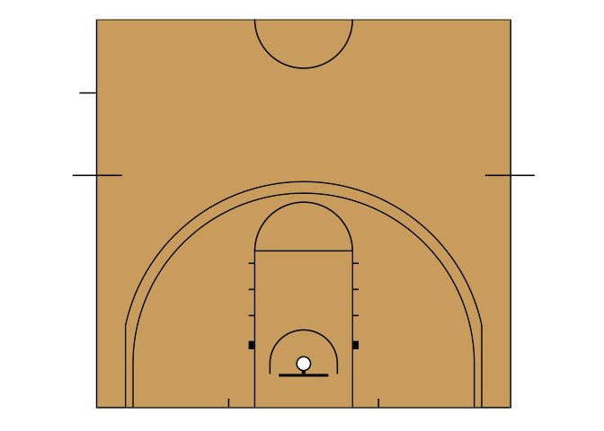

<!-- README.md is generated from README.Rmd. Please edit that file -->

# sportyR

<!-- badges: start -->

[](https://github.com/rossdrucker/sportyR/actions)
[](https://github.com/rossdrucker/sportyR/actions)
[](https://codecov.io/gh/rossdrucker/sportyR)
[](https://opensource.org/licenses/MIT)
<!-- badges: end -->

As the field of sports analytics evolve, there’s a growing need for
methods to both track and visualize players throughout the game. This
package aims to make this easy regardless of sport needed to be plotted.

## Installation

You can install the released version of `sportyR` from
[GitHub](https://github.com/rossdrucker/sportyR) with:

``` r
# install.packages("devtools")
devtools::install_github("rossdrucker/sportyR")
```

Once the library is installed, be sure to load it into the working
environment.

``` r
library(sportyR)
```

## Plotting Functions

All plotting functions in this library are named as `geom_{sport}()`,
and take most (if not all) of the following arguments:

-   `league`: the league code for the sport. In all functions, this will
    ***NOT*** have a default value. The supplied league is
    **case-insensitive**. Future iterations of this package may allow
    the full league name to be supplied if desired
    (e.g. `league = 'National Basketball Associaton'` instead of
    `league = 'NBA'`), but this feature is not currently available.

-   `full_surf`: a boolean indicating whether or not to plot the full
    surface. This defaults to `TRUE`. <br> ***NOTE**: this argument is
    not taken in `geom_baseball()`, `geom_football()`, or
    `geom_soccer()` as these surfaces are always shown in full.*

-   `rotate`: a boolean indicating whether or not to rotate the surface.
    All surfaces will be horizontal by nature. This defaults to `FALSE`

-   `rotation_dir`: the direction in which to rotate the plot (if
    `rotate == TRUE`). This defaults to `'ccw'` for counterclockwise.

## Helpful Functions

In addition to the plotting functions, there are functions that are
available to help the user see what is possible to be plotted. These are
the `caniplot` functions: `caniplot_league()` and `caniplot_sport()`.
Call `?caniplot_sport` and `?caniplot_league` for more information on
these functions, but an example is shown below.

``` r
caniplot_league('mlb')
#> A plot for MLB can be created via the geom_baseball() function
```

## Examples

Most playing surfaces are standard in size, so they can be rendered via
a call to the proper `geom_{sport}()` like so:

``` r
geom_hockey('nhl')
```


However, certain functions are able to take additional parameters. As an
example, soccer pitches are not always a standard size. For this reason,
users can specify in the call to `geom_soccer()` what the touchline and
goal line dimensions should be (in meters).

``` r
geom_soccer('fifa', touchline_length = 100, goal_line_length = 75)
```


It’s also possible to plot half-surfaces and rotated surfaces:

``` r
geom_basketball('ncaa', full_surf = FALSE, rotate = TRUE)
```



## Authorship

This package was developed and is being maintained by [Ross
Drucker](https://github.com/rossdrucker). Please reach out with any
questions, bugs, or suggestions.
