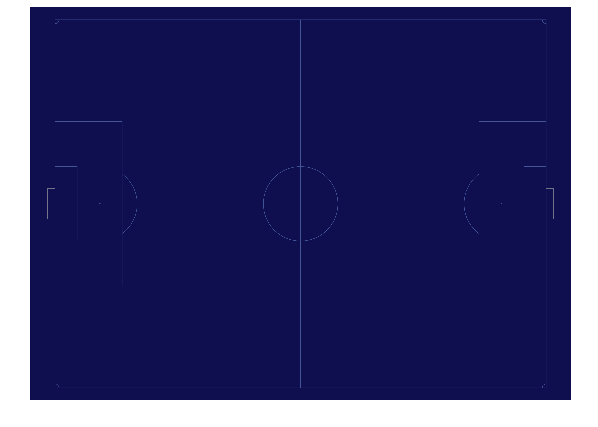

<!-- README.md is generated from README.Rmd. Please edit that file -->

# sportyR

<!-- badges: start -->

[](https://github.com/rossdrucker/sportyR)
[](https://github.com/rossdrucker/sportyR/actions)
[](https://github.com/rossdrucker/sportyR/actions)
[](https://codecov.io/gh/rossdrucker/sportyR)
[](https://opensource.org/licenses/MIT)
<!-- badges: end -->

As the field of sports analytics evolve, there’s a growing need for
methods to both track and visualize players throughout the game. This
package aims to make this easy regardless of sport needed to be plotted.

## Installation

You can install `sportyR` from
[GitHub](https://github.com/rossdrucker/sportyR) with:

``` r
# install.packages("devtools")
devtools::install_github("rossdrucker/sportyR")
```

Once the library is installed, be sure to load it into the working
environment.

``` r
library(sportyR)
library(ggplot2)
library(gganimate)
```

## Plotting Functions

All plotting functions in this library are named as `geom_{sport}()`,
and take the following arguments:

-   `league`: the league code for the sport. In all functions, this will
    ***NOT*** have a default value. The supplied league is
    **case-insensitive**. Future iterations of this package may allow
    the full league name to be supplied if desired
    (e.g. `league = 'National Basketball Associaton'` instead of
    `league = 'NBA'`), but this feature is not currently available.

-   `full_surf`: a boolean indicating whether or not to plot the full
    surface. This defaults to `TRUE`. <br> ***NOTE**: this argument is
    not taken in `geom_baseball()` as this surfaces is always shown in
    full (there’d be no reason to only draw half the diamond).*

-   `rotate`: a boolean indicating whether or not to rotate the surface.
    All surfaces will be horizontal by nature. This defaults to `FALSE`

-   `rotation_dir`: the direction in which to rotate the plot (if
    `rotate == TRUE`). This defaults to `'ccw'` for counterclockwise.

## Surface Examples

Most playing surfaces are standard in size, so they can be rendered via
a call to the proper `geom_{sport}()` like so:

``` r
# Draw a basic NHL rink plot
geom_hockey('nhl')
```


However, certain functions are able to take additional parameters. As an
example, soccer pitches are not always a standard size. For this reason,
users can specify in the call to `geom_soccer()` what the touchline and
goal line dimensions should be (in meters).

``` r
# Create a 100m by 75m FIFA pitch
geom_soccer('fifa', touchline_length = 100, goal_line_length = 75)
```


It’s also possible to plot half-surfaces and rotated surfaces:

``` r
# Draw half of a rotated NBA court
geom_basketball('nba', full_surf = FALSE, rotate = TRUE)
```


Creating a realistic, customized output plot is also possible by
supplying the proper arguments to recolor. More information on how to
customize is in the [next section](#cani-Functions). ***NOTE**: not all
of the arguments below are needed, however all are shown to display the
flexibility with which the plots can be customized.*

``` r
# Create a totally customized NCAA basketball court
geom_basketball(
  'ncaa',
  court_background_color = '#e8e0d7',
  center_circle_color = '#13294b',
  division_line_color = '#13294b',
  endline_color = '#13294b',
  sideline_color = '#13294b',
  team_bench_color = '#13294b',
  substitution_area_color = '#13294b',
  court_apron_color = '#e84a27',
  m_three_point_line_color = '#13294b',
  w_three_point_line_color = '#ffffff',
  m_two_point_range_color = '#e8e0d7',
  w_two_point_range_color = '#ffffff66',
  amateur_free_throw_lane_color = '#ffffff',
  amateur_painted_area_color = '#e84a27',
  amateur_free_throw_lane_lines_color = '#ffffff',
  free_throw_semi_circle_line_color = '#ffffff',
  free_throw_semi_circle_fill_color = '#e8e0d7',
  lower_defensive_box_color = '#13294b',
  restricted_area_arc_color = '#13294b',
  backboard_color = '#13294b',
  basket_ring_color = '#13294b',
  net_color = '#ffffff'
)
```


Another quick example with a soccer pitch:

``` r
geom_soccer(
  'nwsl',
  grass_color = '#131862',
  touchline_1_color = '#546bab',
  touchline_2_color = '#546bab',
  goal_line_color = '#546bab',
  halfway_line_color = '#546bab',
  center_circle_color = '#546bab',
  corner_circle_1_color = '#546bab',
  corner_circle_2_color = '#546bab',
  corner_circle_3_color = '#546bab',
  corner_circle_4_color = '#546bab',
  box_6yd_color = '#546bab',
  box_18yd_color = '#546bab',
  penalty_arc_color = '#546bab',
  penalty_mark_color = '#546bab',
  center_mark_color = '#546bab',
  goal_color = '#87889c'
)
```



## `cani` Functions

The main functionality of plotting is intended to be straightforward and
easy to use. However, questions are sure to arise about what can and
can’t be plotted and customized in the current version of the package.
The `cani_` family of functions are here to help answer those questions
directly. Their syntax is meant to resemble a question like

> Can I plot a football field?

or

> Can `sportyR` make a baseball plot?

and message you back with the answer. Here’s how they work:

``` r
cani_plot_league('mlb')
#> A plot for MLB can be created via the geom_baseball() function
```

``` r
cani_color_league_features('nba')
#> Here are the viable plotting features to color for NBA:
#> 
#> court_background_color
#> inner_center_circle_color
#> outer_center_circle_color
#> division_line_color
#> endline_color
#> sideline_color
#> team_bench_color
#> substitution_area_color
#> court_apron_color
#> three_point_line_color
#> two_point_range_color
#> professional_free_throw_lane_color
#> professional_painted_area_color
#> amateur_free_throw_lane_color
#> amateur_painted_area_color
#> professional_free_throw_lane_lines_color
#> amateur_free_throw_lane_lines_color
#> free_throw_semi_circle_line_color
#> free_throw_semi_circle_fill_color
#> free_throw_dashed_semi_circle_color
#> lower_defensive_box_color
#> restricted_area_arc_color
#> backboard_color
#> basket_ring_color
#> net_color
```

For more information, call `?cani_plot_league`, `?cani_plot_sport`, or
`?cani_color_league_features`.

## Adding Tracking Data

Because this package is an extension of the `ggplot2` package, data can
be added much the same way on top of the surface plot that
`geom_{sport}()` creates. Although tracking data isn’t widely publicly
available yet, there are a few examples to use. The data sources for the
following examples are below.

`sportyR` makes shot charts in all sports significantly easier. Here’s a
look at a shot chart from an NWHL game between the Minnesota Whitecaps
and the Boston Pride (data provided for the [Big Data Cup -
2021](https://github.com/bigdatacup/Big-Data-Cup-2021)):

``` r
# Read data from the Big Data Cup
bdc_data = read.csv('https://raw.githubusercontent.com/bigdatacup/Big-Data-Cup-2021/main/hackathon_nwhl.csv')

# Shift coordinates to fit on the rink
bdc_data['X.Coordinate'] = bdc_data['X.Coordinate'] - 100
bdc_data['Y.Coordinate'] = bdc_data['Y.Coordinate'] - 42.5

# Subset to only be shots from the game on 2021-01-23 between the Minnesota
# White Caps and Boston Pride
bdc_shots = bdc_data[(bdc_data$Event == 'Shot') &
                     (bdc_data$Home.Team == 'Minnesota Whitecaps') &
                     (bdc_data$game_date == '2021-01-23'), ]

# Separate shots by team
whitecaps_shots = bdc_shots[bdc_shots$Team == 'Minnesota Whitecaps', ]
pride_shots = bdc_shots[bdc_shots$Team == 'Boston Pride', ]

# Reflect the Boston Pride shots to make them appear on the other side of the
# ice
pride_shots['X.Coordinate'] = -1 * pride_shots['X.Coordinate']

# Draw the rink
nwhl_rink = geom_hockey('nwhl')

# Add the shot locations
nwhl_rink +
  geom_point(data = whitecaps_shots, aes(X.Coordinate, Y.Coordinate), color = '#2251b8') +
  geom_point(data = pride_shots, aes(X.Coordinate, Y.Coordinate), color = '#fec52e')
```


The functionality of `sportyR` also makes gif-making via `gganimate`
much easier as well. This is a play from Week 15 of the 2018 NFL season
between the Chicago Bears and Green Bay Packers. Data made available for
the [Big Data Bowl
2021](https://www.kaggle.com/c/nfl-big-data-bowl-2021) Kaggle
competition.

``` r
# Load the play data
example_nfl_play = read.csv('data-raw/example-pbp-data.csv')

# Prep data for plotting
example_nfl_play[example_nfl_play['team'] == 'home', 'color'] = '#c83803'
example_nfl_play[example_nfl_play['team'] == 'away', 'color'] = '#ffb612'
example_nfl_play[example_nfl_play['team'] == 'football', 'color'] = '#624a2e'

# Create the field
nfl_field = geom_football('nfl')

# Add the points on the field
play_anim = nfl_field +
  geom_point(data = example_nfl_play, aes(x, y), color = example_nfl_play$color) +
  transition_time(example_nfl_play$frameId)

# Show the animation
play_anim
```


## Authorship

This package was developed and is being maintained by [Ross
Drucker](https://github.com/rossdrucker). Please reach out with any
questions, bugs, or suggestions.
