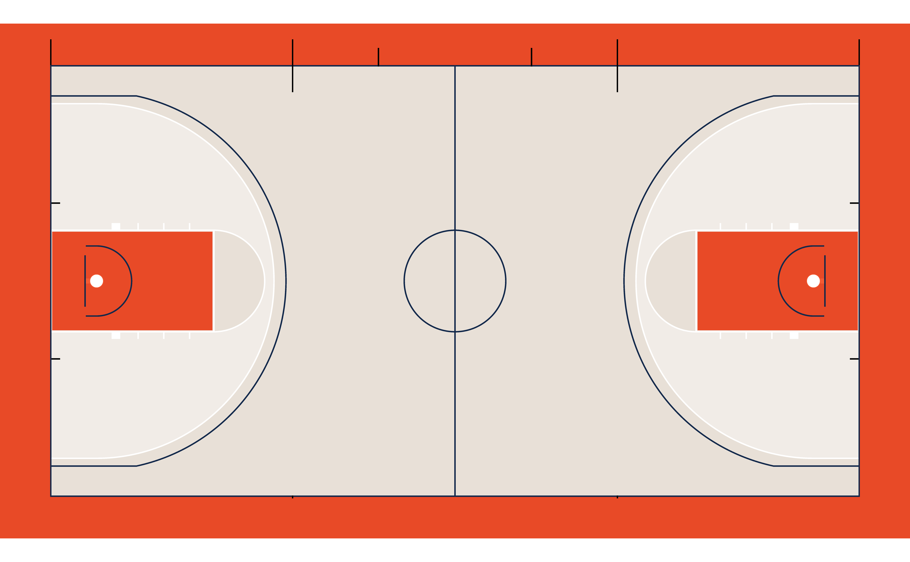
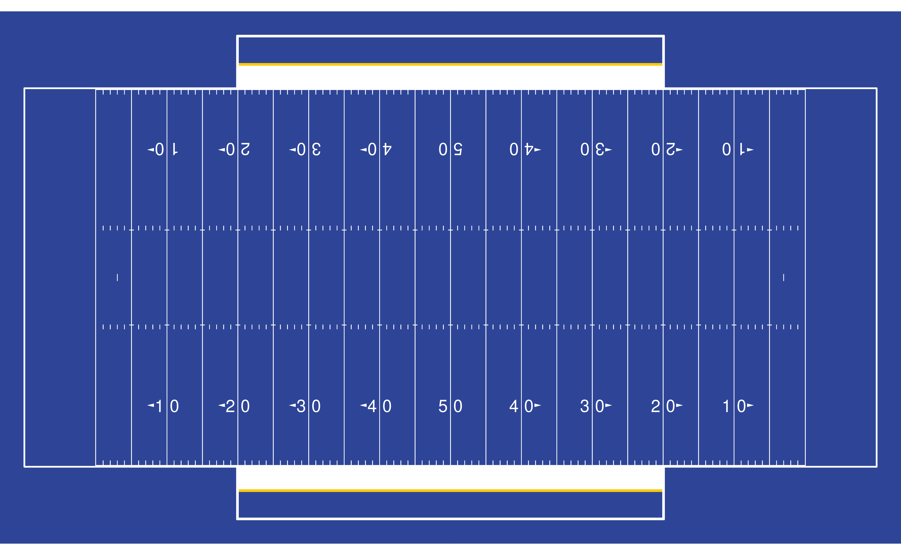

# Customizing Plots

To run the following vignette, you’ll need the `sportyR` package loaded
into your workspace.

``` r

library(sportyR)
```

Customizing a plot is easy as can be with `sportyR`. Say we want to
customize a college basketball court to look like Lou Henson Court at
the University of Illinois at Urbana-Champaign. You can see what it
looks like
[here](https://hoopdirt.com/wp-content/uploads/2015/08/louhensoncourt-rendering-690x340.jpg)

We won’t get an exact match with logos, floorboard color
differentiation, or some markings, but we’ll get pretty close. Let’s
start by finding out what colors we can change, and how we can change
them:

``` r

# Find the colors for a college basketball court
cani_color_league_features("NCAA", "basketball")
#> Here are the viable plotting features to color for NCAA basketball:
#> 
#> plot_background
#> defensive_half_court
#> offensive_half_court
#> court_apron
#> center_circle_outline
#> center_circle_fill
#> division_line
#> endline
#> sideline
#> two_point_range
#> three_point_line
#> painted_area
#> lane_boundary
#> free_throw_circle_outline
#> free_throw_circle_fill
#> free_throw_circle_dash
#> lane_space_mark
#> inbounding_line
#> substitution_line
#> baseline_lower_defensive_box
#> lane_lower_defensive_box
#> team_bench_line
#> restricted_arc
#> backboard
#> basket_ring
#> net
```

Great, all set. It looks like the following should work:

***NOTE**: not all of the arguments below are needed, however all are
shown to display the flexibility with which the plots can be
customized.*

``` r

geom_basketball(
  league = "ncaa",
  color_updates = list(
    offensive_half_court = "#e8e0d7",
    defensive_half_court = "#e8e0d7",
    court_apron = "#e84a27",
    two_point_range = c("#e8e0d7", "#ffffff66"),
    center_circle_fill = "#e8e0d7",
    painted_area = c("#e84a27", "#ffffff00"),
    free_throw_circle_fill = "#e8e0d7",
    sideline = "#13294b",
    endline = "#13294b",
    division_line = "#13294b",
    center_circle_outline = "#13294b",
    lane_boundary = c("#ffffff", "#ffffff00"),
    three_point_line = c("#13294b", "#ffffff"),
    free_throw_circle_outline = "#ffffff",
    lane_space_mark = "#ffffff",
    restricted_arc = "#13294b",
    backboard = "#13294b"
  )
)
```



Pretty good! You can do this for any of the surfaces offered by
`sportyR`. Here’s another example, this time drawing a blue college
football field:

``` r

# Create a blue football field
geom_football(
  "ncaa",
  color_updates = list(
    field_apron = "#2e4597",
    field_border = "#2e4597",
    offensive_endzone = "#2e4597",
    defensive_endzone = "#2e4597",
    offensive_half = "#2e4597",
    defensive_half = "#2e4597",
    team_bench_area = "#2e4597"
  )
)
```


