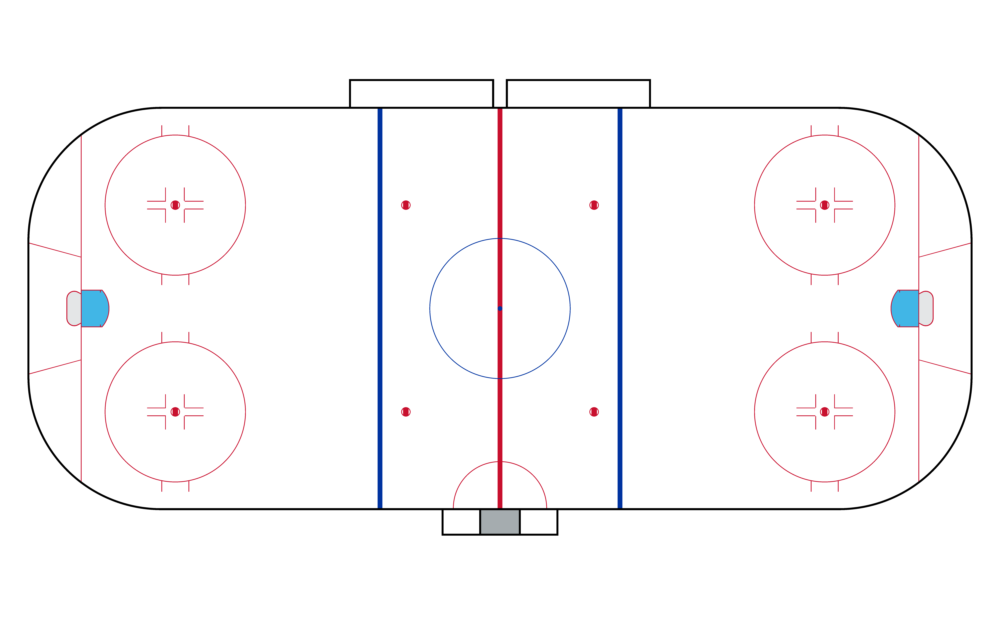
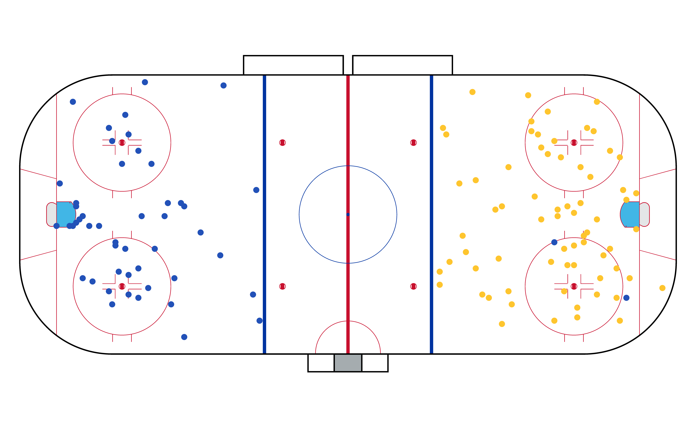
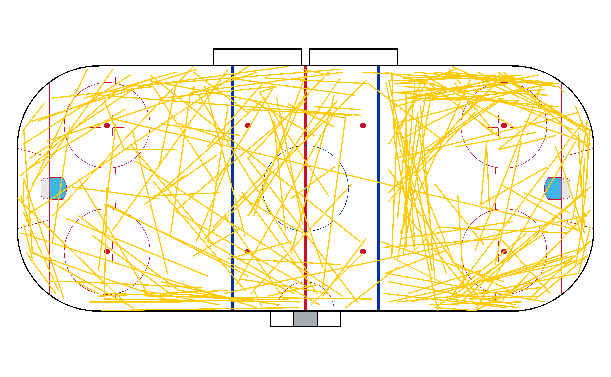

# Plotting Tracking Data

In order to run the following vignettes, you’ll need the `sportyR` and
`ggplot2` libraries loaded into your workspace.

``` r

library(sportyR)
library(ggplot2)
```

## Introduction

`sportyR` seeks to make plotting geospatial tracking data as
straight-forward as possible, allowing you to focus more on the analysis
than on the visuals. I’ll demonstrate a few examples here on how to use
the package to display “static” data, or data that shows a snapshot in
time

## The Data

For this example, I’ll be using the data provided for the [Big Data
Cup](https://stathletes.com/big-data-cup), which is publicly available.
Specifically, the data I’ll use to demonstrate how to plot comes from
the data provided for the [Big Data Cup -
2021](https://github.com/bigdatacup/Big-Data-Cup-2021).

Start by reading in the data from the CSV file provided:

``` r

# Read data from the Big Data Cup
bdc_data <- data.table::fread(
  glue::glue(
    "https://raw.githubusercontent.com/bigdatacup/Big-Data-Cup-2021",
    "/main/hackathon_nwhl.csv"
  )
)

# Convert to data frame
bdc_data <- as.data.frame(bdc_data)
```

Let’s explore the dataset a bit to see what (if any) changes would be
helpful

``` r

names(bdc_data)
#>  [1] "game_date"         "Home Team"         "Away Team"        
#>  [4] "Period"            "Clock"             "Home Team Skaters"
#>  [7] "Away Team Skaters" "Home Team Goals"   "Away Team Goals"  
#> [10] "Team"              "Player"            "Event"            
#> [13] "X Coordinate"      "Y Coordinate"      "Detail 1"         
#> [16] "Detail 2"          "Detail 3"          "Detail 4"         
#> [19] "Player 2"          "X Coordinate 2"    "Y Coordinate 2"
```

It’d be helpful to change the names of the columns to be easier to work
with, so I’ll change `X Coordinate` and `Y Coordinate` to be `x` and
`y`, and `X Coordinate 2` and `Y Coordinate 2` to be `x2` and `y2`.

``` r

# Change names of X Coordinate and Y Coordinate to x and y respectively
names(bdc_data)[13:14] <- c("x", "y")
names(bdc_data)[20:21] <- c("x2", "y2")

# Preview what the data looks like
knitr::kable(head(bdc_data))
```

| game_date | Home Team | Away Team | Period | Clock | Home Team Skaters | Away Team Skaters | Home Team Goals | Away Team Goals | Team | Player | Event | x | y | Detail 1 | Detail 2 | Detail 3 | Detail 4 | Player 2 | x2 | y2 |
|:---|:---|:---|---:|:---|---:|---:|---:|---:|:---|:---|:---|---:|---:|:---|:---|:---|:---|:---|---:|---:|
| 2021-01-23 | Minnesota Whitecaps | Boston Pride | 1 | 20:00 | 5 | 5 | 0 | 0 | Boston Pride | Jillian Dempsey | Faceoff Win | 100 | 43 | Backhand |  |  |  | Stephanie Anderson | NA | NA |
| 2021-01-23 | Minnesota Whitecaps | Boston Pride | 1 | 19:58 | 5 | 5 | 0 | 0 | Boston Pride | McKenna Brand | Puck Recovery | 107 | 40 |  |  |  |  |  | NA | NA |
| 2021-01-23 | Minnesota Whitecaps | Boston Pride | 1 | 19:57 | 5 | 5 | 0 | 0 | Boston Pride | McKenna Brand | Zone Entry | 125 | 28 | Carried |  |  |  | Maddie Rowe | NA | NA |
| 2021-01-23 | Minnesota Whitecaps | Boston Pride | 1 | 19:55 | 5 | 5 | 0 | 0 | Boston Pride | McKenna Brand | Shot | 131 | 28 | Snapshot | On Net | t | f |  | NA | NA |
| 2021-01-23 | Minnesota Whitecaps | Boston Pride | 1 | 19:53 | 5 | 5 | 0 | 0 | Boston Pride | Tereza Vanisova | Faceoff Win | 169 | 21 | Backhand |  |  |  | Stephanie Anderson | NA | NA |
| 2021-01-23 | Minnesota Whitecaps | Boston Pride | 1 | 19:52 | 5 | 5 | 0 | 0 | Boston Pride | Samantha Davis | Puck Recovery | 159 | 26 |  |  |  |  |  | NA | NA |

I’ll use the first game in the data here, which is between the Minnesota
Whitecaps and the Boston Pride. To keep things easy I’ll focus first on
single-point data: shots.

``` r

# Subset to only be shots from the game on 2021-01-23 between the Minnesota
# White Caps and Boston Pride
bdc_shots <- bdc_data[(bdc_data$Event == "Shot") &
                        (bdc_data$`Home Team` == "Minnesota Whitecaps") &
                        (bdc_data$game_date == "2021-01-23"), ]

# Separate shots by team
whitecaps_shots <- bdc_shots[bdc_shots$Team == "Minnesota Whitecaps", ]
pride_shots <- bdc_shots[bdc_shots$Team == "Boston Pride", ]
```

To keep all shots for a team on the same side of the ice, we need to
adjust the coordinates of the shot. We’ve got to keep the shooter’s
perspective towards the net constant as well, so the following is an
appropriate transformation.

``` r

# Correct the shot location
whitecaps_shots["x"] <- 200 - whitecaps_shots["x"]
whitecaps_shots["y"] <- 85 - whitecaps_shots["y"]
```

This positions the data correctly, so let’s move on to plotting

## Drawing the Plot

Since this data pertains to the Premier Hockey Federation (PHF), we’ll
start the plotting by drawing a PHF-sized rink. We’ll use `x_trans` and
`y_trans` to align the data and plot coordinates. I encourage you to
experiment with the data to see how this works in practice

``` r

# Draw the rink
phf_rink <- geom_hockey("phf", x_trans = 100, y_trans = 42.5)

# Display the rink here
phf_rink
```



Now all that’s left to do is to add the data points to the plot! Because
of how `ggplot2` is designed, this is very straightforward.

## Adding the Data

``` r

# Add the shots to the plot
phf_rink +
  geom_point(data = whitecaps_shots, aes(x, y), color = "#2251b8") +
  geom_point(data = pride_shots, aes(x, y), color = "#fec52e")
```



## Two-Coordinate Data

Pretend instead that we want to look at where a team’s passes were
executed during the game. This is also very easy to do. Let’s take the
same dataset we had before, `bdc_data`, and this time subset it to look
at Boston’s passes in the game. We’ve already got our rink plot from
before, so let’s just subset to the passing data, and add it to the
plot:

``` r

# Subset the data to be Boston's passes
boston_passes <- bdc_data[(bdc_data$Event == "Play") &
                            (bdc_data$Team == "Boston Pride") &
                            (bdc_data$game_date == "2021-01-23"), ]

# Plot passes with geom_segment()
phf_rink +
  geom_segment(
    data = boston_passes,
    aes(
      x = x,
      y = y,
      xend = x2,
      yend = y2
    ),
    lineend = "round",
    linejoin = "round",
    color = "#ffcb05"
  )
```



And there you have it! This works for any geospatial data, for any sport
(supported by `sportyR`), and for any league (supported by `sportyR`).
Give it a try, and please reach out if you have ideas for improvements!
